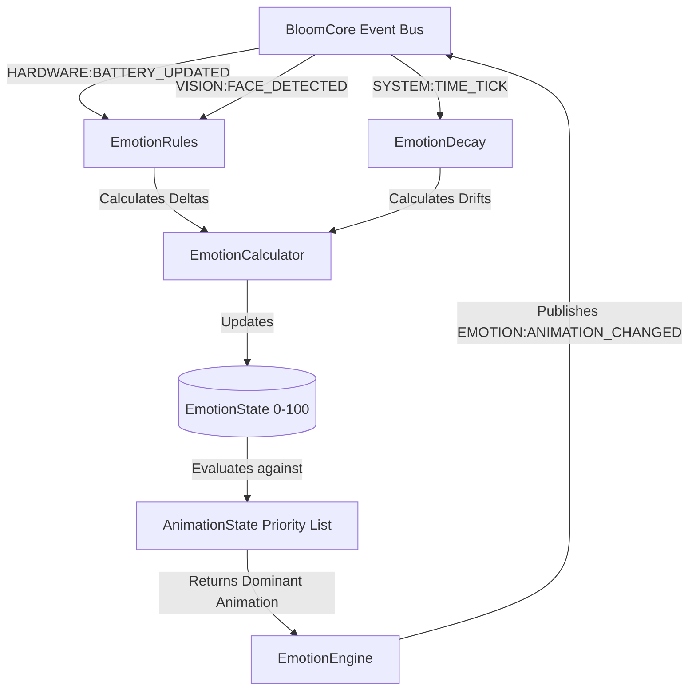
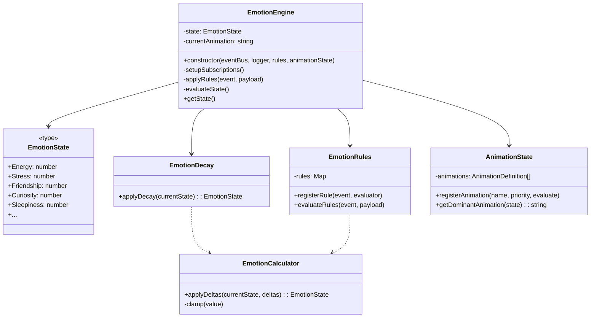
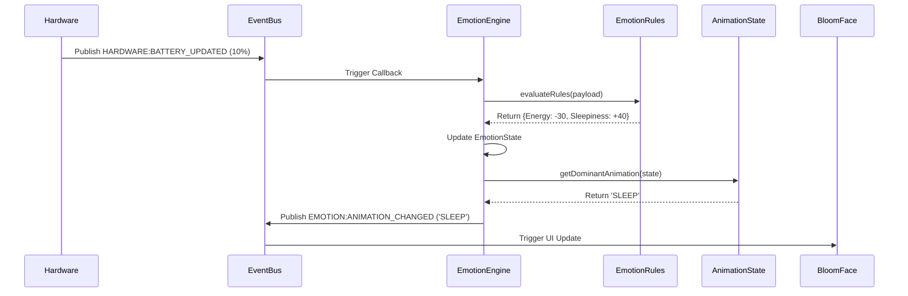

# BloomEmotion

**BloomEmotion** is the psychological state engine for Project Koru. It is **not** an animation controller. It continuously evaluates Koru's internal emotional state based on stimuli received from the `BloomCore` Event Bus, and publishes the resulting dominant emotional expression.

## Architecture Diagram



## UML Class Diagram



## Sequence Diagram



## How To Guides

### Adding a New Emotion Variable
1. Open `EmotionState.ts`.
2. Add the key to `EmotionKey` (e.g. `'Angry'`).
3. Add a default value to `DEFAULT_EMOTION_STATE`.

### Adding a New Rule
Rules define how Koru reacts to the world.
In your setup script:
```typescript
rules.registerRule('USER:HIT', () => {
  return { Stress: +50, Friendship: -20, Angry: +80 };
});
```

### Adding a New Animation
Animations evaluate the current state. There are no direct triggers.
```typescript
anims.registerAnimation('ANGRY_FACE', 2, (state) => state.Angry > 80 && state.Stress > 50);
```
Priority `1` is the highest. If multiple animations evaluate to `true`, the highest priority wins.
